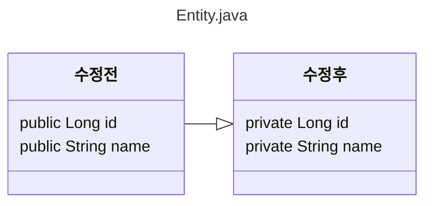

# Vert.x 서비스 작성 시작

쿼커스 버텍스 퀵스타트를 기반으로 코드 작성시작
기존 퍼블릭 필드를 프라이빗 필드로 변경
 추가 코드는 get,set 퍼블릭 메서드()
프라이빗으로 변경시 퍼블릭 게러세러 메서드 없이
엑세스 불가

<details>
 
 ## 수정된 내용
 
 <summary> 리팩터링 </summary>




</details>


<details>
  
  <summary> 추가 코드 </summary>


  ### 엑세스 하기 위한 메서드 생성
  

> 
> 롬북을 사용하여 자동생성 하는 방법도 있다
>

  
  
```java
    public String getName(){
        return name;
    }

    public Long getId(){
        return id;
    }

    public void setName(String name){
        this.name=name;
    }

    public void setId(Long id){
        this.id=id;
    }
```

</details>


