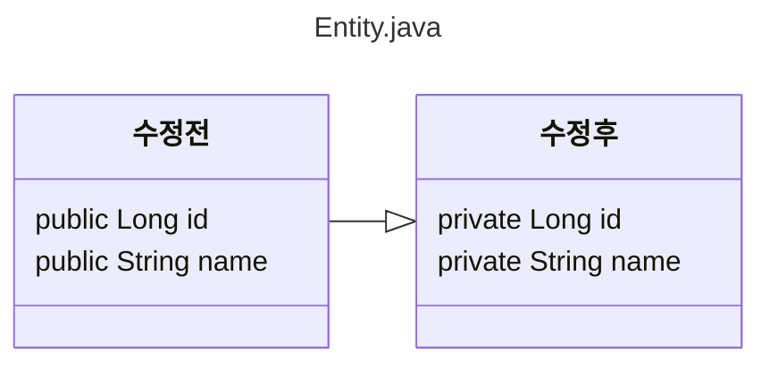
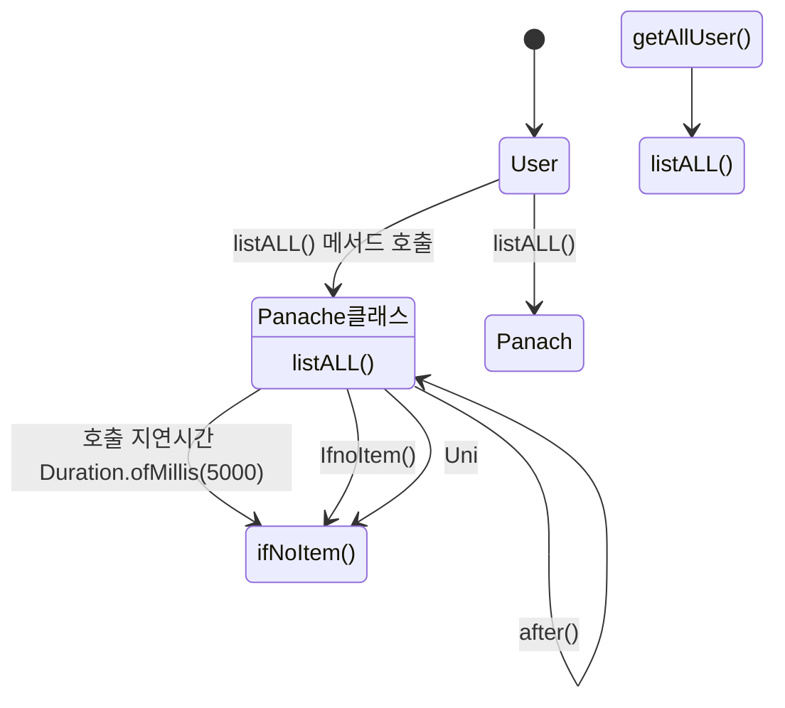

# Vert.x 서비스 작성 시작

쿼커스 버텍스 퀵스타트를 기반으로 코드 작성시작
기존 퍼블릭 필드를 프라이빗 필드로 변경
 추가 코드는 get,set 퍼블릭 메서드()
프라이빗으로 변경시 퍼블릭 게러세러 메서드 없이
엑세스 불가

<details>
 
 ## 수정된 내용
 
 <summary> 리팩터링 </summary>




</details>


<details>
  
  <summary> 추가 코드 </summary>


  ### 엑세스 하기 위한 메서드 생성
  

> 
> 롬북을 사용하여 자동생성 하는 방법도 있다
>

  
  
```java
    public String getName(){
        return name;
    }

    public Long getId(){
        return id;
    }

    public void setName(String name){
        this.name=name;
    }

    public void setId(Long id){
        this.id=id;
    }
```

</details>


> [!CAUTION]
> 시큐리티 디펜던시가 추가되어 있을경우 REST클래스에 접근 권한을 설정해줘야 한다
> 공개 ,비공개 권한에따라 비공개 등... 정의되지 않은 경로는 페이지 출력 안됨


# 유저 리스트 조회

메서드 생성
Uni<List<User>> 타입 static 메서드 생성



```mermaid

sequenceDiagram
getAllUser() -->> User : 메서드 호출 
User -->> Panache : listAll() 메서드 호출
Panache -->> User : listAll() 반환
Uni-->> Uni : after(Duration.ofMillis(5000) 응답 대기 시간
Panache  -->> Uni : ifNoItem() 아이템 없다면
Uni -->> Uni : onFailure().recoverWithUni(Uni.createFrom()
Uni -->> getAllUser() : EMTY_List 반환 -> []


```

```
    public static Uni<List<User>> getAllUser(){
        return User.listAll().ifNoItem().after(Duration.ofMillis(5000)).fail().onFailure().recoverWithUni(Uni.createFrom().<List<PanacheEntityBase>>item(Collections.EMPTY_LIST));
    }

```


