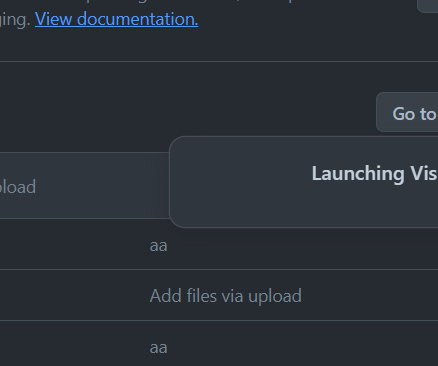

https://quarkus.io/guides/rest-client#customizing-the-objectmapper-in-rest-client-jackson
https://quarkus.io/guides/security-keycloak-admin-client



```java
package demo.plain;

import org.keycloak.OAuth2Constants;
import org.keycloak.admin.client.CreatedResponseUtil;
import org.keycloak.admin.client.Keycloak;
import org.keycloak.admin.client.KeycloakBuilder;
import org.keycloak.admin.client.resource.RealmResource;
import org.keycloak.admin.client.resource.UserResource;
import org.keycloak.admin.client.resource.UsersResource;
import org.keycloak.representations.idm.ClientRepresentation;
import org.keycloak.representations.idm.CredentialRepresentation;
import org.keycloak.representations.idm.RoleRepresentation;
import org.keycloak.representations.idm.UserRepresentation;

import javax.ws.rs.core.Response;
import java.util.Arrays;
import java.util.Collections;

public class KeycloakAdminClientExample {

  public static void main(String[] args) {

    String serverUrl = "http://sso.tdlabs.local:8899/u/auth";
    String realm = "acme";
    // idm-client needs to allow "Direct Access Grants: Resource Owner Password Credentials Grant"
    String clientId = "idm-client";
    String clientSecret = "0d61686d-57fc-4048-b052-4ce74978c468";

    //		// Client "idm-client" needs service-account with at least "manage-users, view-clients, view-realm, view-users" roles for "realm-management"
    //		Keycloak keycloak = KeycloakBuilder.builder() //
    //				.serverUrl(serverUrl) //
    //				.realm(realm) //
    //				.grantType(OAuth2Constants.CLIENT_CREDENTIALS) //
    //				.clientId(clientId) //
    //				.clientSecret(clientSecret).build();

    // User "idm-admin" needs at least "manage-users, view-clients, view-realm, view-users" roles for "realm-management"
    Keycloak keycloak = KeycloakBuilder.builder() //
                                       .serverUrl(serverUrl) //
                                       .realm(realm) //
                                       .grantType(OAuth2Constants.PASSWORD) //
                                       .clientId(clientId) //
                                       .clientSecret(clientSecret) //
                                       .username("idm-admin") //
                                       .password("admin") //
                                       .build();

    // Define user
    UserRepresentation user = new UserRepresentation();
    user.setEnabled(true);
    user.setUsername("tester1");
    user.setFirstName("First");
    user.setLastName("Last");
    user.setEmail("tom+tester1@tdlabs.local");
    user.setAttributes(Collections.singletonMap("origin", Arrays.asList("demo")));

    // Get realm
    RealmResource realmResource = keycloak.realm(realm);
    UsersResource usersRessource = realmResource.users();

    // Create user (requires manage-users role)
    Response response = usersRessource.create(user);
    System.out.printf("Repsonse: %s %s%n", response.getStatus(), response.getStatusInfo());
    System.out.println(response.getLocation());
    String userId = CreatedResponseUtil.getCreatedId(response);

    System.out.printf("User created with userId: %s%n", userId);

    // Define password credential
    CredentialRepresentation passwordCred = new CredentialRepresentation();
    passwordCred.setTemporary(false);
    passwordCred.setType(CredentialRepresentation.PASSWORD);
    passwordCred.setValue("test");

    UserResource userResource = usersRessource.get(userId);

    // Set password credential
    userResource.resetPassword(passwordCred);

    //        // Get realm role "tester" (requires view-realm role)
    RoleRepresentation testerRealmRole = realmResource.roles()//
                                                      .get("tester").toRepresentation();
    //
    //        // Assign realm role tester to user
    userResource.roles().realmLevel() //
                .add(Arrays.asList(testerRealmRole));
    //
    //        // Get client
    ClientRepresentation app1Client = realmResource.clients() //
                                                   .findByClientId("app-frontend-springboot").get(0);
    //
    //        // Get client level role (requires view-clients role)
    RoleRepresentation userClientRole = realmResource.clients().get(app1Client.getId()) //
                                                     .roles().get("user").toRepresentation();
    //
    //        // Assign client level role to user
    userResource.roles() //
                .clientLevel(app1Client.getId()).add(Arrays.asList(userClientRole));

    // Send password reset E-Mail
    // VERIFY_EMAIL, UPDATE_PROFILE, CONFIGURE_TOTP, UPDATE_PASSWORD, TERMS_AND_CONDITIONS
    //        usersRessource.get(userId).executeActionsEmail(Arrays.asList("UPDATE_PASSWORD"));

    // Delete User
    //        userResource.remove();
  }
}
```

# security-keycloak-admin-org.acme.Client

This project uses Quarkus, the Supersonic Subatomic Java Framework.

If you want to learn more about Quarkus, please visit its website: https://quarkus.io/ .

## Running the application in dev mode

You can run your application in dev mode that enables live coding using:
```shell script
./mvnw compile quarkus:dev
```

> **_NOTE:_**  Quarkus now ships with a Dev UI, which is available in dev mode only at http://localhost:8080/q/dev/.

## Packaging and running the application

The application can be packaged using:
```shell script
./mvnw package
```
It produces the `quarkus-run.jar` file in the `target/quarkus-app/` directory.
Be aware that it’s not an _über-jar_ as the dependencies are copied into the `target/quarkus-app/lib/` directory.

The application is now runnable using `java -jar target/quarkus-app/quarkus-run.jar`.

If you want to build an _über-jar_, execute the following command:
```shell script
./mvnw package -Dquarkus.package.jar.type=uber-jar
```

The application, packaged as an _über-jar_, is now runnable using `java -jar target/*-runner.jar`.

## Creating a native executable

You can create a native executable using: 
```shell script
./mvnw package -Dnative
```

Or, if you don't have GraalVM installed, you can run the native executable build in a container using: 
```shell script
./mvnw package -Dnative -Dquarkus.native.container-build=true
```

You can then execute your native executable with: `./target/security-keycloak-admin-org.acme.Client-1.0.0-SNAPSHOT-runner`

If you want to learn more about building native executables, please consult https://quarkus.io/guides/maven-tooling.

## Related Guides

- REST Jackson ([guide](https://quarkus.io/guides/rest#json-serialisation)): Jackson serialization support for Quarkus REST. This extension is not compatible with the quarkus-resteasy extension, or any of the extensions that depend on it
